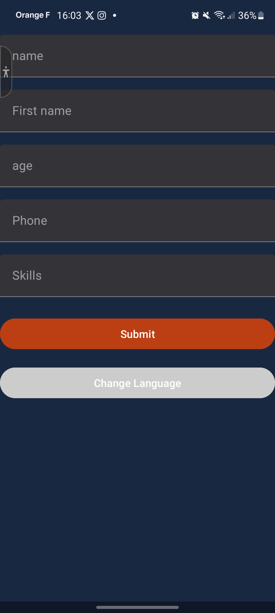
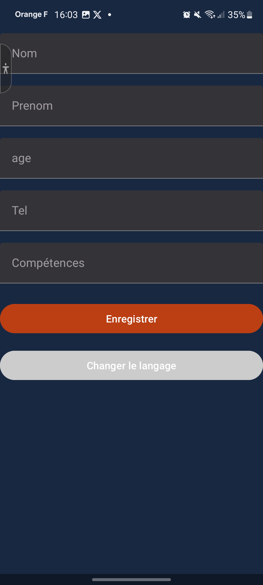
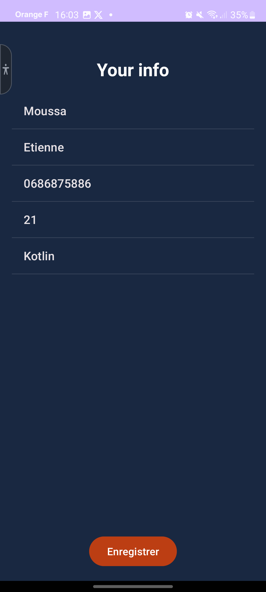
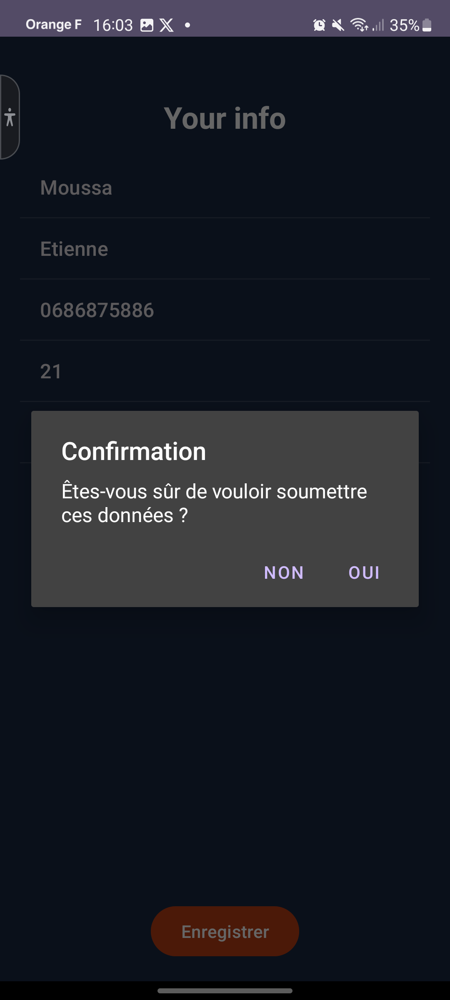
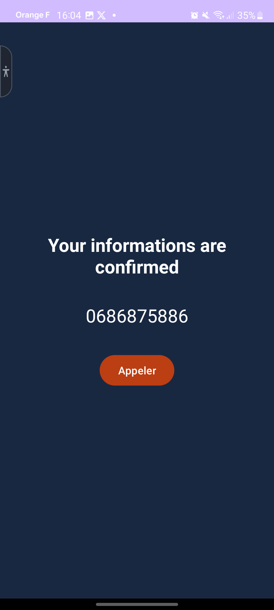

# FirstAndroidApp

## Introduction

### Instructions d'installation

#### Avec Android Studio
1. Clonez le dépôt sur votre machine locale.
2. Ouvrez Android Studio et sélectionnez "Ouvrir un projet existant".
3. Naviguez jusqu'au dépôt cloné et sélectionnez-le.
4. Laissez Android Studio télécharger et installer toutes les dépendances nécessaires.
5. Une fois le projet chargé, cliquez sur le bouton "Exécuter" pour construire et exécuter l'application sur un émulateur ou un appareil connecté.

#### Sans Android Studio
1. Clonez le dépôt sur votre machine locale.
2. Assurez-vous d'avoir installé le SDK Android et Gradle.
3. Ouvrez un terminal et naviguez jusqu'au répertoire du projet.
4. Exécutez la commande suivante pour construire le projet :
   ```bash
   ./gradlew build
   ```
5. Pour installer l'application sur un appareil connecté, exécutez :
   ```bash
   ./gradlew installDebug
   ```

## Objectif de l'application
L'objectif de cette application était de découvrir la programmation mobile et ses concepts de base via Android Studio. 
L'UI de cette application n'est donc pas des plus travaillée, car elle sert "d'introduction" au domaine.
Les deux applications suivantes, elles, seront plus poussées.

## Présentation de l'interface utilisateur
Voici des images de l'interface démontrant les différentes fonctionnalités.

### Écran d'accueil

Page d'accueil avec les différents inputs, un bouton dubmit pour valider les infos et un bouton pour changer de langage.

 


### Écran d'accueil (Français)

Page en Français. La langue est définie par le thème de base de l'appareil. Un changement est aussi possible avec le bouton.

 

### Écran de récapitulatif des informations

Page récapitulant les informations avant validation.

 

 ### Écran de confirmation des données

En appuyant sur enregistrer, une popup de validation apparît. "Oui permet de valider et de passer à la page suivante. "Non" reviens à la page d'accueil

 

### Écran d'appel

Dernière page après validation des informations permattant d'appeller le numéro enregistré.

 
